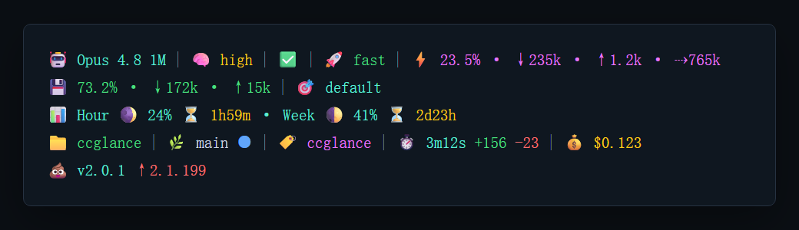

# ccglance

> 面向 [Claude Code](https://docs.anthropic.com/en/docs/claude-code) 的轻量多行状态栏 —— 模型、effort、上下文、缓存、git、会话,一眼尽览。TypeScript 编写、运行时零依赖。

[](https://nodejs.org/)
[](./LICENSE)

[English](./README.md) | 简体中文

仓库：[github.com/CxMYu/CcGlanceLine](https://github.com/CxMYu/CcGlanceLine)

`ccglance` 以 Claude Code 通过 stdin 传入的 JSON 为主数据源；`status`
段只在启用时读取 transcript(会话记录)尾部。它用 **TypeScript** 编写,以编译后的
JavaScript 发布,**运行时零依赖**(仅用 Node 标准库)。

## 预览



截图由 `ccglance preview` 生成。

## 特性

- **紧凑多行布局** —— 运行时、订阅配额、项目/会话分成逻辑行；无数据的行自动消失。
- **运行时零依赖** —— 仅用 Node 标准库;TypeScript 仅为构建期工具,不进发布包。
- **stdin 优先** —— 核心段消费 Claude Code 提供的 JSON；status 只读 transcript 尾部固定字节。
- **上下文块** —— 占用百分比、本轮输入/输出 token、剩余 token。
- **缓存块** —— 缓存命中率、读取/写入 token。
- **git 段** —— 分支、干净/脏/冲突标记、领先/落后计数；只跑一次有界 `git status`，并带短缓存。
- **会话段** —— 耗时 + 新增/删除行数。
- **Claude Code 版本 + 更新提示** —— 显示 stdin 里的 Claude Code `version`；
  本地 4 小时缓存发现新版时追加 `↑latest`。刷新在 stdout 写出后异步进行，不阻塞状态栏。
- **额外会话信息** —— 5小时/7天配额、美元成本，以及 Claude Code 提供时显示在 git 分支右侧的 worktree 名。
- **响应式多行布局** —— 读终端宽度(`COLUMNS`),把每行按能容纳的宽度自动折成多行;
  正确处理 CJK/emoji 显示宽度。
- **固定内置风格** —— 不读取用户配置文件，也不读取外部样式文件；状态栏使用 ccglance 自己的 emoji 优先风格。

## 环境要求

- Node.js **>= 22**
- `git`(可选,仅 git 段需要)

Claude Code 兼容性：

| Claude Code CLI | ccglance 行为 |
|---|---|
| >= 1.0.71 | 支持基础 statusline stdin |
| >= 2.1.80 | 官方 `rate_limits.five_hour` / `rate_limits.seven_day` 字段存在时显示订阅配额行 |
| >= 2.1.153 | 优先使用 `COLUMNS` / `LINES` 做终端宽度适配；更旧版本回退到 TTY 宽度或 80 列 |

配额行只面向订阅场景。Claude.ai Pro/Max 这类订阅会话可能提供 `rate_limits`；
API key、Bedrock、Vertex 等按量/外部网关场景通常没有该字段，ccglance 会隐藏配额行，
不会自行推断或伪造。

## 安装

### 方式 A —— npm 全局安装(推荐)

```bash
npm install -g @cxmyu/ccglance          # npm
yarn global add @cxmyu/ccglance         # 或 yarn
pnpm add -g @cxmyu/ccglance             # 或 pnpm
```

registry 慢?用国内镜像:

```bash
npm install -g @cxmyu/ccglance --registry https://registry.npmmirror.com
```

npm 会下载**预编译好的 `dist/`**(本机不跑编译器),并把 `ccglance` 命令装到 `PATH`。
需要 Node.js **>= 22**。

安装之后:

- ✅ `ccglance` 命令全局可用。
- ⚙️ **只装不会自动生效** —— 必须把 `statusLine` 块加进 `~/.claude/settings.json`
  (见 [配置](#配置)),然后重启 Claude Code。
- 🔎 用 `ccglance preview`(样例渲染)或 `ccglance --help`(用法 + 完整 settings.json
  配置)验证。在普通终端直接敲 `ccglance` 只会打印这份帮助。

后续可用 `npm update -g @cxmyu/ccglance` 更新、`npm uninstall -g @cxmyu/ccglance` 卸载。

### 方式 B —— 从源码构建

```bash
git clone https://github.com/CxMYu/CcGlanceLine.git
cd CcGlanceLine
npm install             # 安装 devDeps；随后 prepare 脚本自动编译 src/ → dist/
npm link                # 可选：把 ccglance 链到本机 PATH
```

`npm install` 已经通过 `prepare` 生命周期脚本帮你构建好 `dist/`,**无需再单独跑构建**。
编译产物入口为 `dist/cli.js`;`ccglance` bin 命令和 `node dist/cli.js` 是同一个文件。验证:

```bash
node dist/cli.js preview
```

## 配置

在 `~/.claude/settings.json` 加入 `statusLine`:

```json
{
  "statusLine": {
    "type": "command",
    "command": "ccglance",
    "padding": 0
  }
}
```

若未全局安装,直接用 Node 指向编译后的文件:

```json
{
  "statusLine": {
    "type": "command",
    "command": "node /绝对路径/ccglance/dist/cli.js"
  }
}
```

Windows 用完整路径,例如 `node D:\\path\\to\\ccglance\\dist\\cli.js`。

> **跨平台路径**:Claude Code v2.1.47+ 会在所有平台展开命令开头的 `~`,所以
> `node ~/path/to/dist/cli.js` 也能用。优先用 `~` 而非 `%USERPROFILE%`(近版本不可靠);
> 全局的 `ccglance` 命令则完全不需要写路径。`"padding": 0` 去掉 Claude Code 默认的左侧缩进,
> 让状态栏从最左开始。

## 状态栏速览

三个逻辑行,任意一行无数据时自动消失:

1. **运行时** —— 🤖 模型 · 🧠 effort · 状态 · 🚀 fast · ⚡️ 上下文 · 💾 缓存 · 🎯 风格
2. **配额**(仅订阅会话)—— 📊 Hour / Week 配额仪表
3. **项目 / 会话** —— 📁 目录 · 🌿 git · 🏷️ 会话名 · ⏱️ 会话 · 💰 成本 · 💩 版本

**完整参考** —— 每个段的 stdin 来源、所有图标含义、配额月相档位、会话状态图标与颜色语义 ——
见 **[docs/segments.zh-CN.md](./docs/segments.zh-CN.md)**。

## 原理

每次刷新时,Claude Code 会运行你配置的 `command`,并把一段 JSON(模型、effort、
上下文窗口、cost、workspace、版本……)从 **stdin** 传入。`ccglance` 用
`fs.readFileSync(0)` 一次性读入、按固定行格式化并**先打印**；`status`
只会读取 transcript 尾部固定字节。版本段同步阶段只读本地小缓存；stdout 写出之后，如果
Claude Code 最新版缓存超过 4 小时，才 detached 后台刷新 npm registry。若 JSON 解析失败则
静默退出,绝不影响 CLI。来自 stdin、transcript、git 的文本在输出前会清理终端控制序列，
避免逃逸到状态栏之外。主要外部调用是本地 `git`(单次有界 status 调用并带短缓存)、按需
transcript 尾部读取，以及渲染后的后台版本检查。

## 开发

源码构建、测试、基准、代码结构、贡献范式与 git 缓存内部细节见
**[docs/development.zh-CN.md](./docs/development.zh-CN.md)**。快速开始:

```bash
git clone https://github.com/CxMYu/CcGlanceLine.git
cd CcGlanceLine
npm install        # devDeps + prepare 构建
npm test           # 构建 + node:test
```

## 缓存文件

`ccglance` 只落盘可丢弃的运行缓存：git 状态、transcript 派生状态、Claude Code 最新版本缓存。
文件按 `git/`、`transcript/`、`version/` 分组。

所有平台都统一落在 Claude Code 自己的配置目录下,随 Claude 配置一起走、清理也方便:

```text
~/.claude/ccglance/
├── git/          # git 状态快照(每个仓库一个)
├── transcript/   # transcript 派生的会话状态
└── version/      # Claude Code 最新版本检查
```

若设置了 `CLAUDE_CONFIG_DIR` 改变 Claude Code 配置目录,ccglance 的缓存会跟着落到该目录下。
整个 `ccglance/` 目录随时可安全删除 —— 下次渲染会自动重建。

git 缓存逻辑(缓存 key、`HEAD` 兜底、20 分钟 TTL、detached 刷新、原子写)见
[docs/development.zh-CN.md](./docs/development.zh-CN.md#git-缓存内部细节)。

## 相关项目

- [CCometixLine](https://github.com/Haleclipse/CCometixLine) —— Rust 编写的高性能状态栏,带交互式 TUI 配置与主题
- [ccstatusline](https://github.com/sirmalloc/ccstatusline) —— 可配置、支持 powerline 风格的状态栏
- [claude-powerline](https://github.com/Owloops/claude-powerline) —— 轻量的 powerline 风格状态栏

## 贡献

欢迎提 issue 和 PR。改代码前请先跑 `npm run typecheck`、`npm run build`、`ccglance preview`;
请保持**运行时零依赖**和固定风格(不加配置加载器)。

## Star History

[](https://star-history.com/#CxMYu/CcGlanceLine&Date)

## 许可

[MIT](./LICENSE) © 2026 CxMYu
